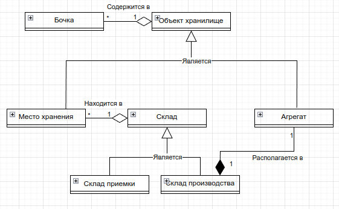

# barrels-accounting
Backend сервиса учета лакокрасочных материалов (ЛКМ).

## Словарь терминов

Лакокрасочный материал - ЛКМ

Бочка (Barrel) - единица учета ЛКМ.

Объект хранилище (StorageObject) - АБСТРАКЦИЯ. некоторая сущность, которая может хранить в себе бочки.

Место хранения (МХ, StoragePlace) - конкретное место на складе (типо стеллаж).

Агрегат (Aggregate) - устройство на производстве, в котором смешиваются краски. В него можно списывать бочки.

Склад (Storage) - АБСТРАКЦИЯ. склад, на котором располагаются МХ или агрегаты.

Склад приёмки (AcceptanceStorage) - склад, на который поступают новые бочки от поставщиков.

Склад производства (ProductionStorage) - склад, с которого производится списание бочек в агрегат.

